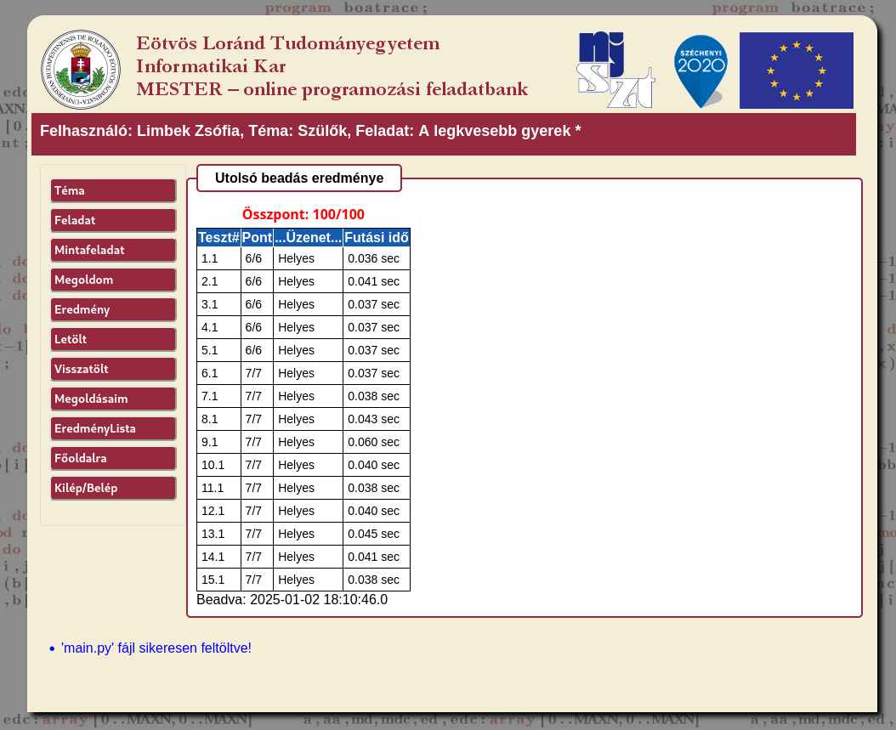
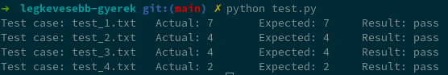

# Feladat: "A legkevesebb gyerek"

A Mester jelentése a megoldásomról:



# Tesztelési terv

| Sorszám | Teszteset                                                    | Tesztállomány neve | Elvárt kimenet |
|---------|--------------------------------------------------------------|--------------------|----------------|
| 1.      | Feladatleírásba foglalt példa                                | `test_1.txt`       | 7              |
| 2.      | Holtverseny                                                  | `test_2.txt`       | 4              |
| 3.      | Holtverseny, a nagyobb sorszámú szülő van előbb a bemenetben | `test_3.txt`       | 4              |
| 4.      | Minimális példa                                              | `test_4.txt`       | 2              |


# Tesztelő script futtatása

A tesztelő script neve `test.py`.
A futtatáshoz egy mappában kell lennie a `test_input.csv` fájllal és a fenti táblázatban felsorolt tesztállományokkal.
Ugyanez a mappa legyen a working directory.

Parancs:

```shell
python test.py
```

A futás eredménye így néz ki:

